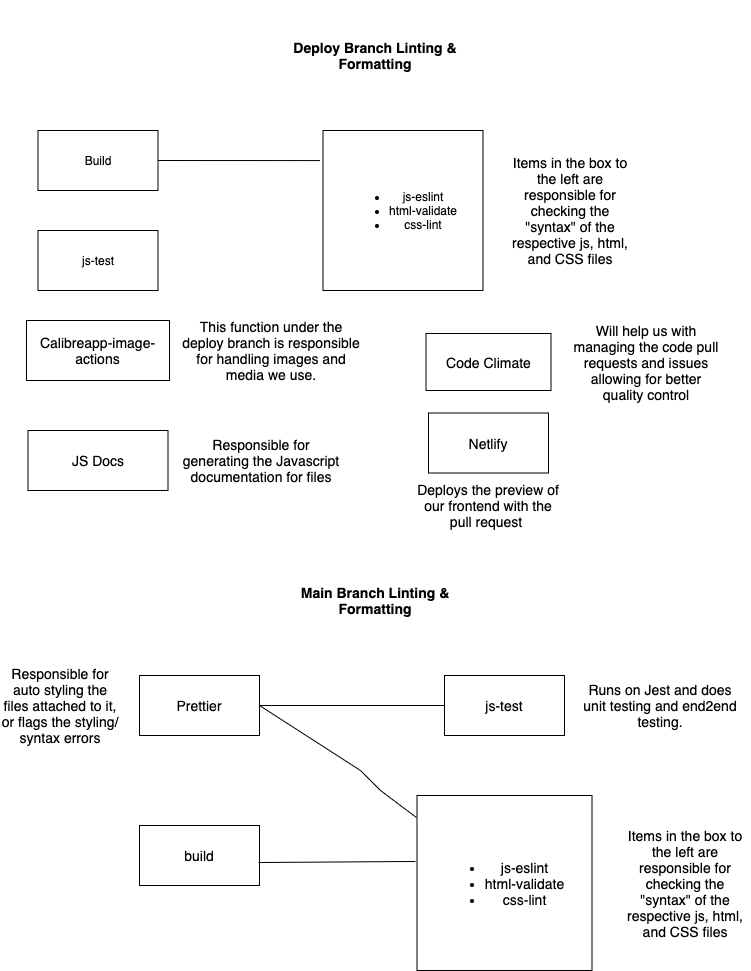

## Status Update on CI/CD Pipeline.

### Group 32, Team Aces, November 30th, 2021

### Functional Aspects of our Pipeline.

Currently, our pipeline has several functional components. One of the key aspects that is guiding our pipeline is the *Deploy Branch Linting & Formatting* workflow which is guiding our linting and formatting. For example, our linting for JavaScript and CSS is completely operational. Similarly, our HTML validator is also working and provides us a mechanism for checking all of our frontend pieces. With regards to images, we have *Calibreapp-image-actions* which allows us to handle the images and media that are being used in the website. This allows for immediate flagging if a particular image is invalid and allows us to solve such issues. Also within the Deploy Branch workflow, we have Netlify which allows us to preview our frontend with each pull request. 

Another part of our pipeline that is operational is our testing. Currently, we are using Jest for testing which is stored within the *js-test* block. This guides our unit testing and said block will eventually guide our end-to-end testing as well.

Lastly, we have another workflow dedicated to our main branch called *Main Branch Linting & Formatting*. Within this workflow, we utilize a Prettier which mirrors our general logic in the *Deploy Branch Linting and Formatting* workflow. One key difference however is that the Prettier is attached to all the lintings *and* the JavaScript testing. The Prettier of course guides our auto styling of styles and helps to alert us quickly about syntax errors. Ultimately, we can ensure uniformity in our code with the Prettier and our workflows in general.

### Planned Aspects of our Pipeline

Perhaps the most important thing that is yet to be fully developed is *CodeClimate* within the *Deploy Branch Linting & Formatting* workflow. This will be essential to providing safety in our pull requests and ensuring that only specific individuals can approve pull requests based on their expertise. Furthermore, *CodeClimate* will give us quality control over our code and can act as a basic "management" system for our increasingly complex codebase. 

### Wrap-Up

Hopefully this has given a brief overview of our pipeline and what we've been able to accomplish. As we continue to build out our codebase and refine our features, we are increasingly confident that our CI/CD pipeline will make the entire process as efficient as possible. Attached below is a diagram representing the high-level logic of the entire pipeline.

Thanks!

-Group 32
