## First Sprint review Meeting
### Team name: Group 32
### Date: 11/17/2021
### Time: 10:00pm - 11:00 pm
### Attendence: Zijian Zhang, Ke Ou, Martin Flores, Tiffany Zhong, Stuart Boynton, You Wu, Bagrat Mikhaelyan, Chenxing Qiu, Hannah Hui
### Absence: Eamon Aalipour
  

## **Today's Topics**
First sprint review meeting. Everyone shares their individual progress and contribution to the project
  

## Accomplishment
- **Zijian Zhang**
    - Implement Calendar with **You Wu**. Including functionalities such as: adding, deleting, dragging and visiting the actual recipe sites. Also finish styling and ready to connect with database.
    - Finishing creating user login page with login page, create account page, forget password page and several confirmation page. Also finish styling and redirection when click link and already handed to backend team to connect database.

    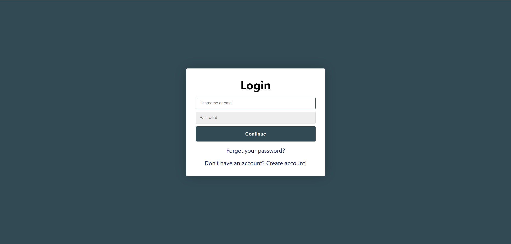
    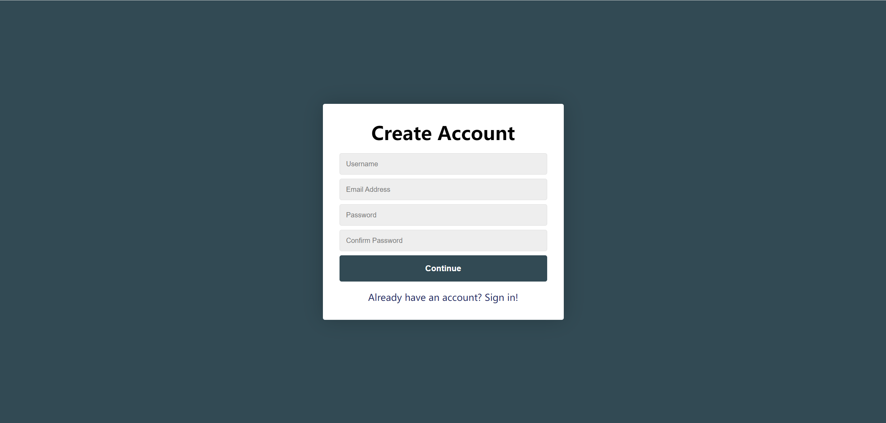
    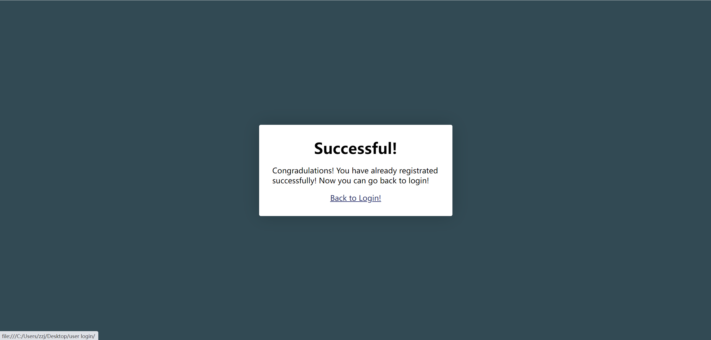
    
      

- **You Wu**
  - Successfully implemented the either deleting event(s) or going to the link action in our calendar when mouse enters/hovers on that event.
  - Developed other functionalities (e.g. adding event(s)) of calendar with Zijian.
  - Explored and decided with Zijian on a specific library for our calendar. 
  - Explored other better ways to delete event(s) containing a link, such as deleting by clicking and deleting by choosing an option in a dropdown menu of that event, and then found them highly impossible since clicking a link always redirects the user to the linked page and dropdown menus are generally only possible as fixed elements on html pages. 
  - Explored how to do modifications specifically on the layout of the week view of our calendar, but found that too difficult to be implemented considering the library that we are using. 
  

https://user-images.githubusercontent.com/91357781/142715571-c97e4c23-2f30-48d6-891a-0a030a2fb829.mp4

    

- **Bagrat Mikhaelyan**
  - Researched about Python vs Node.js and which is better and why, held an in-person meeting with Martin and Stuart to formulate an opinion and gave the results to the team
  - Researched about the best python database to use (i.e Flask) and why, presented findings to the team
  - Created UML functions for JS (get methods and such) alongside a change password function where numerous databases were introduced (Issue #23)
  - Currently in the process of researching about bcrypt and MongoDB for hashing passwords and keeping maximum security, and also helping in the frontend to backend process
  - have mainly done research oriented things, but now that the research phase has ended I have been doing more hands-on stuff.
    

- **Esther Qiu**
  - Created Home Page HTML file with SPA app that is able to reach the recipe card page, user profile page, calendar page, etc.
  - Researched on how to use the search by keywords function with spoonacular API
  - This week I will be working on the general CSS for the home page

    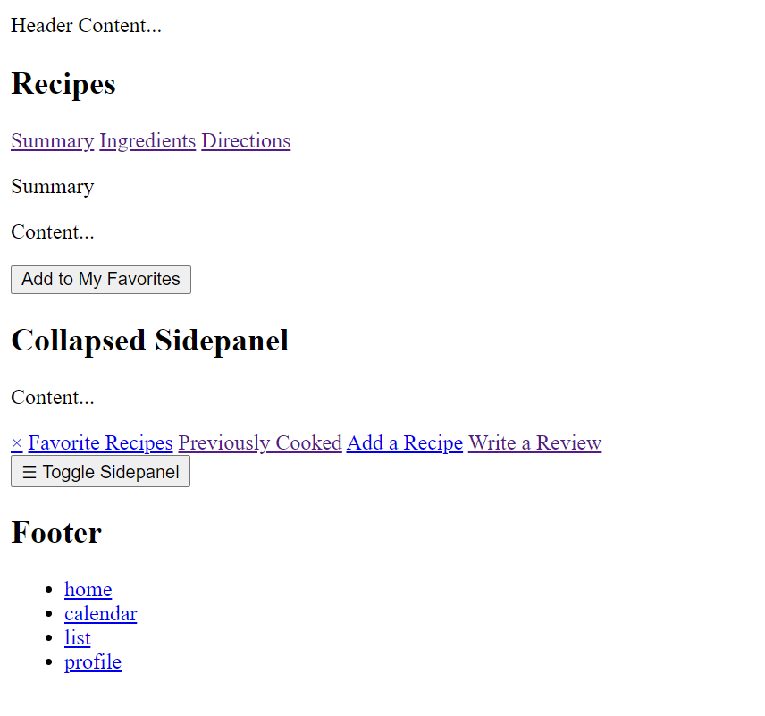
    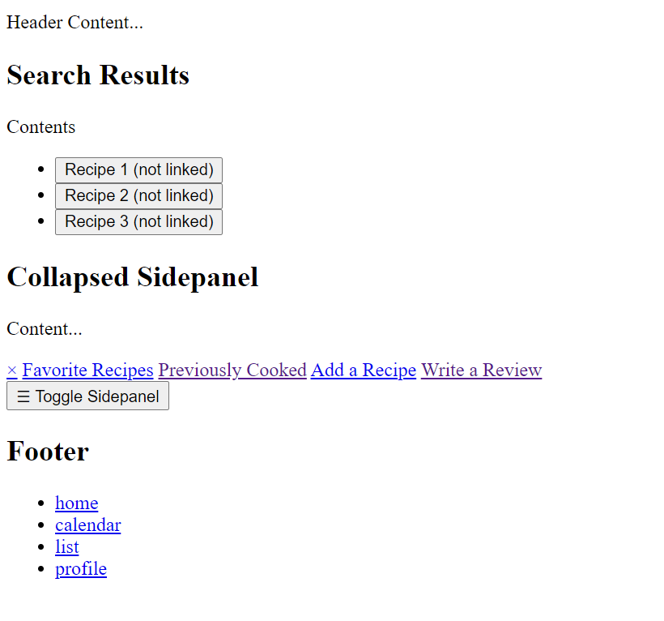
    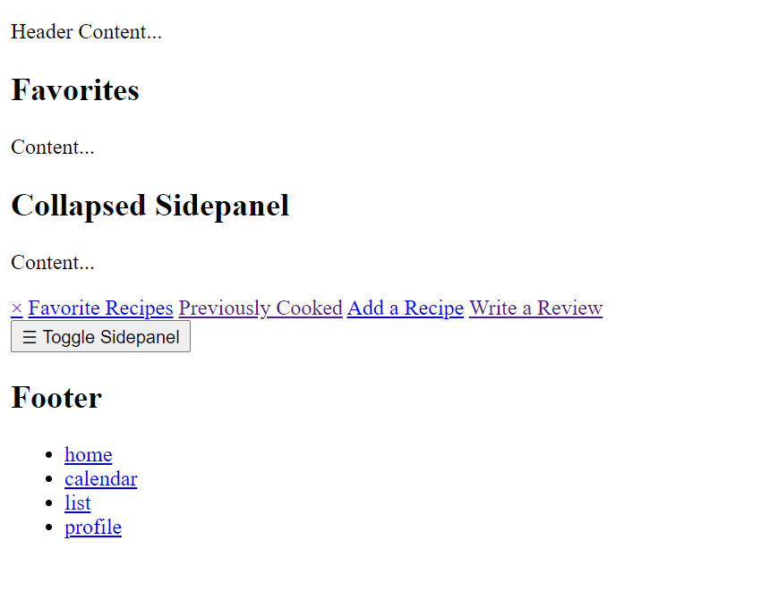
    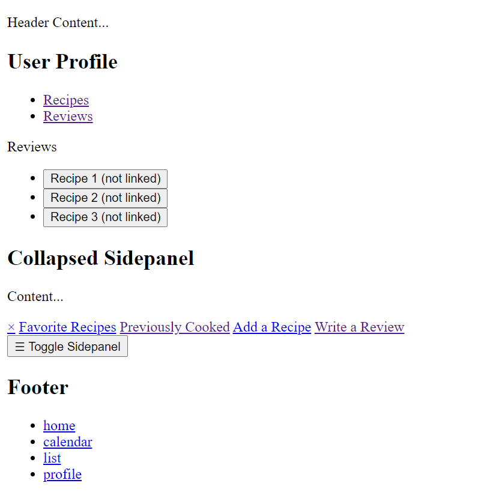
    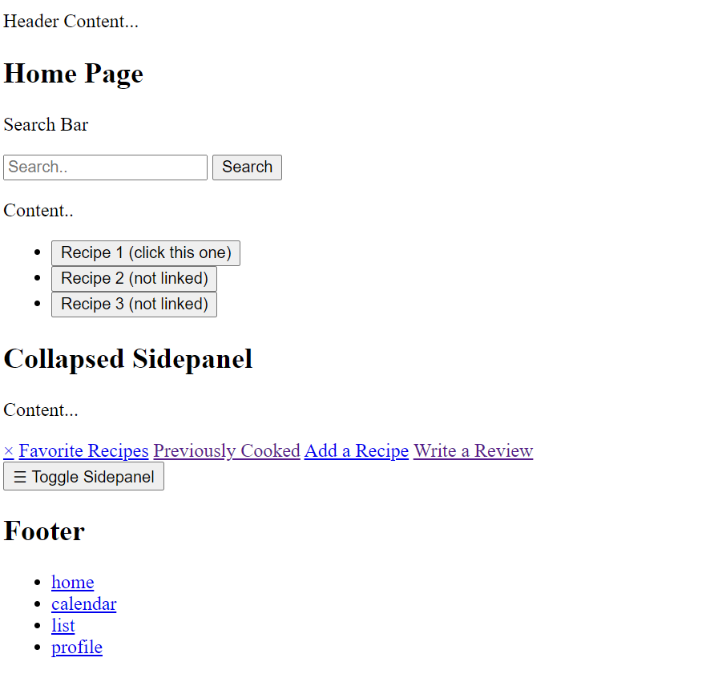
    

- **Martin Flores-leon**
  - helped Hannah test the pipeline and work through some of the encountered bugs. 
  - On another note, I am currently helping the backend team on getting the user login update function to work properly.
  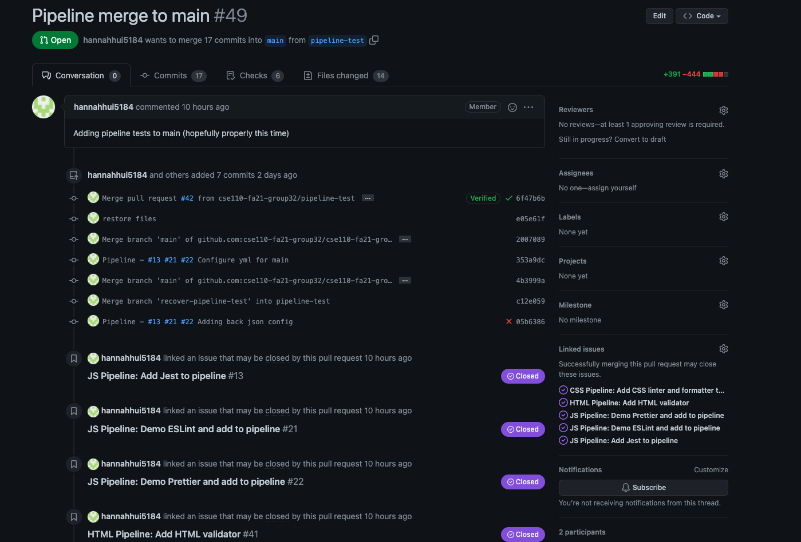
    

- **Stuart Boynton**
  - Implemented functions to allow us to use the Spoonacular API and request information from its database.
  - Created Recipe Cards that will be used to show results for searches
    

- **Tiffany Zhong**
  - In the past few works I created the lofi and hifi prototypes for our app. After that I worked with Esther and Hannah to create the routing system and html elements.
  - I also worked with Stuart to create the recipe card templates.
  
    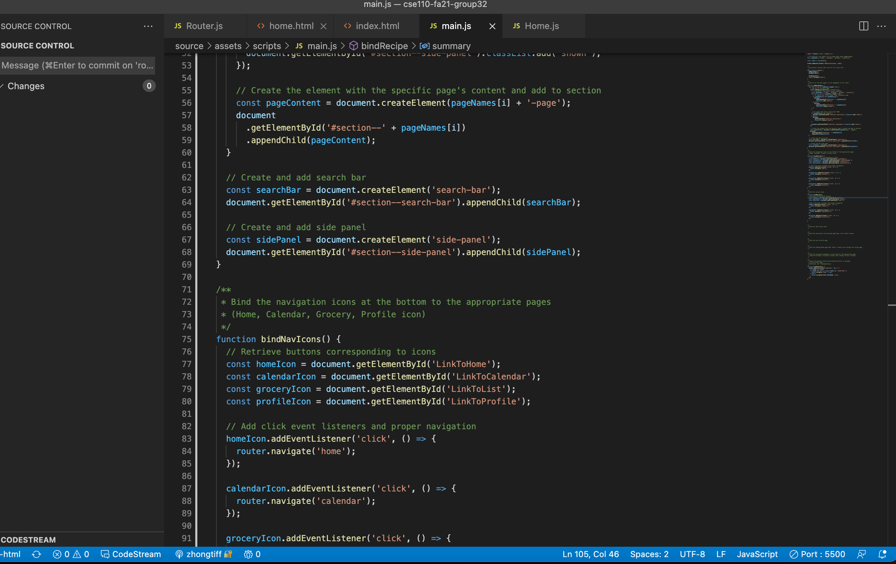
    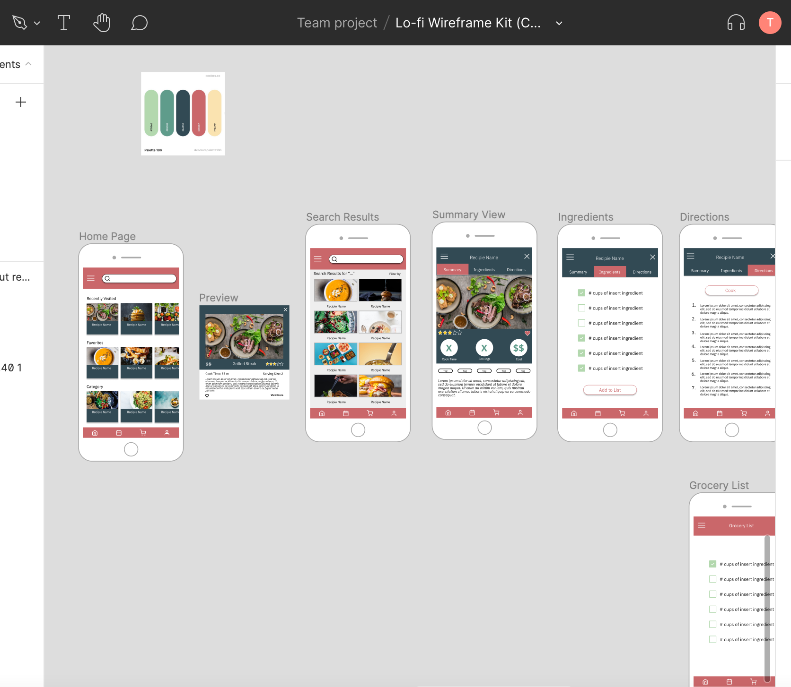
      

- **Eamon Aalipour**
  - As a member on the backend team, I've mainly been working with Ke & Martin to setup the CRUD functionality of our database, with a particular focus on the user login stage. Me, Hannah, and Ke had a Live Share session to set up the initial database and we've been developing the CRUD stages incrementally after that while also using Flask to set up the transfer of information from frontend to backend.
  - Most recently, we've discussed using GCP for hosting. Other things I've done have included doing some PR reviews for the pipeline and reviewing code for the backend in general.

  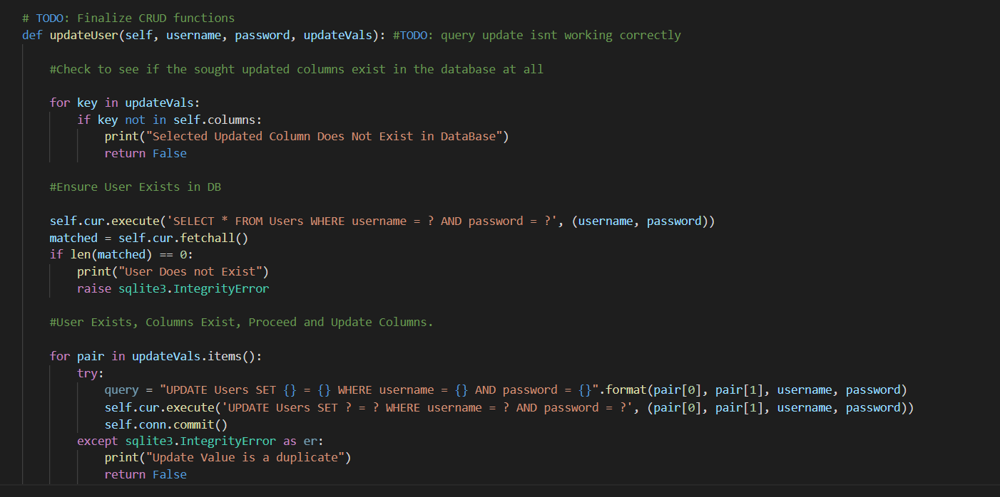
  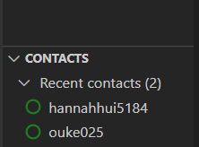
    

- **Ke Ou**
  - As the backend team leader, I’ve worked with Eamon and Martin on creating user database. Investigated and experimented several front-backend communication schemes including socket, WebSocket, HTTP server, etc.. Eventually decide to go with Fetch API + flask server. 
  - Created basic db functionalities such as user registration and PR others’ progress. Finalized login functionality through linking frontend page and backend db. 
  - Helped Esther and Tiffany with routing. 
  - Currently working on linking recipe db, Spoonacular, and frontend for searching by keywords.
  

https://user-images.githubusercontent.com/91357781/142715586-1e5dc19a-823d-47d3-8363-ebc7e5f9b53c.mp4

    

- **Hannah Hui**
  - Set up style guide and repo rules guide
  - Configured project board to be automatically linked with issue creation & pull requests
  - Finished pipeline for linting, formatting, and JS tests
  - Helped with turning our app into an SPA
  - Researched options for hosting
  
 (Hannah's video is too large to put in md file. You can check her video in assets!)
    

## Duration
Time: 40min

             
