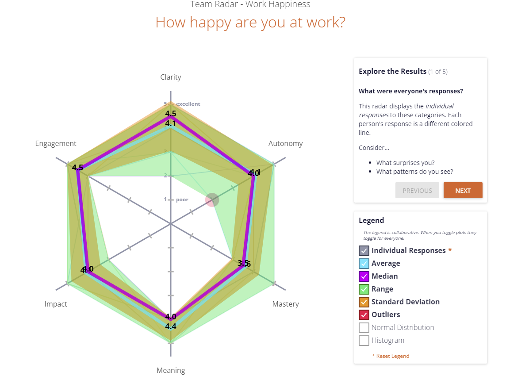

## Retrospective
### Team name: Group 32
### Date: 11/27/2021
### Time: 2:00pm - 3:40 pm
### Attendence: Zijian Zhang, Ke Ou, Martin Flores, Tiffany Zhong, Stuart Boynton, You Wu, Bagrat Mikhaelyan, Chenxing Qiu, Hannah Hui, Eamon Aalipour
### Absence: No absent

## Today's Topics
Discuss about Mad, Sad, Glad for the project and also work-environment that we can know what we are in short of and where can we do better

## Attendence picture 

## Summary
We have summed up what we done in the past week, and what we need to work on for the up-coming week. For that we first did the excerise with the work-environment activity to make sure that the communication is smooth between teammates and then we did the mad, sad, glad activity again to see what we are in short of. At the end, we add some new action plans and went over again with the old action plan to remind us of what we need to maintain.

## Mad:
- Lack of styling and commenting.
- Time crunch from other classes and also  we don't have much time left for this project. 

## Sad:
- Still time constains that it is kind hard to help other who is in need.
- There are some miscommunications

## Glad
- We learned a lot by doing this project, especially in python, javascript, and html
- We made a lot more progress done in the past week
- Members are helping each others
- Communication become way better than before
- Looking forward when the project is fully functional

## Action Plan

## Work Environment Activity

