## Second Sprint review Meeting
### Team name: Group 32
### Date: 11/27/2021
### Time: 2:40 - 3:30
### Attendence: Zijian Zhang, Ke Ou, Martin Flores, Tiffany Zhong, Stuart Boynton, You Wu, Bagrat Mikhaelyan, Chenxing Qiu, Hannah Hui, Eamon Aalipour
### Absence: None
  

## **Today's Topics**
Second sprint review meeting. Everyone shares their individual progress and contribution to the project from first sprint meeting.
  

## Accomplishment
- **Zijian Zhang**
  - Work with Hannah and Stuart to finish implement the recipe page. At the top of this page is a nav bar that you can go between **summary**, **ingredients** and **directions**. There are a brief describtion and picture of recipe in summary section, a list of ingredients that you can select to add in shopping list in ingredients section and a detail steps of cooking in drections section.
  - Also implement the cooking mode functioanly where there is a button on direction section of each recipe, click on that it will lead to the cooking mode where each step will be displayed seperately and users can go back and forth easily by clicking buttons below. There will also be timer in cooking mode where users can time which will be implemented later.

    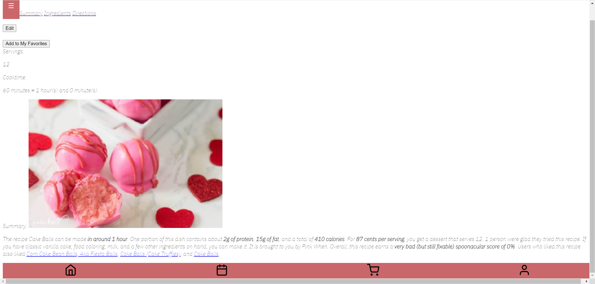
    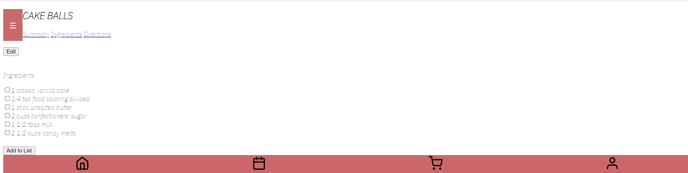
    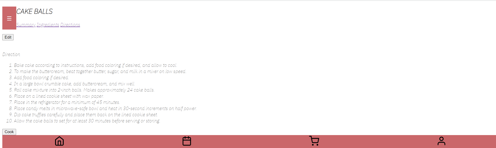
    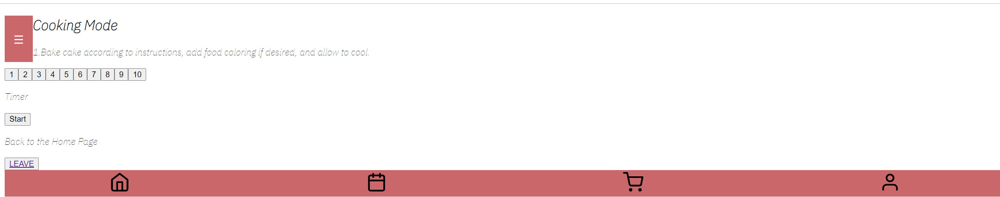

  

- **You Wu**
  - Implemented the layout of user profile page to make it meet the expected layout shown in the pitch by using various structures and properties in CSS.
  - Fixed the side panel so that it does not block those clickable buttons after it is collapsed.
  - Added a table structure to grocery list, so that the ingredient, amount, and unit can be added in the expected order, with each ingredient occupying one row.
  - Implemented other CSS code with Tiffany.

https://user-images.githubusercontent.com/91357781/144157856-f31474a9-1cfa-4b42-a4a8-767d97ae9a03.mp4

  

- **Bagrat Mikhaelyan**
  - Worked with Martin on create and update (CRUD) Recipe functions and got those completed and working in recipe.py and recipe.js
  - Tested the user_db functions and troubleshooted them, worked with Eamon later to solve the issue for Add
  - Worked on profile.js with Martin and got the json to show
  - Helped Stuart with his work and incorporated Cook time and Servings in the recipe view
  - Helped Eamon with the hashing the password using the salt token method I suggested and got that working
  - All around helped anyone that was in need of help through the use of zoom calls
  - Currently working on incorporating the Grocery List

  

- **Esther Qiu**
  - Worked with Stuart for the AddRecipe.js page and UpdateRecipe.js Page, both js files can successfully send the right data to the backend with different button clicked, such as "Publish", "Update", and "Delete"
  - Create Write Review Page with just the frontend html
  - Create Grocery List with the add ingredients, delete, and check button properly working at the frontend
  - Clean up some code at the Recipe.js and re-formalized some of the html part
    
    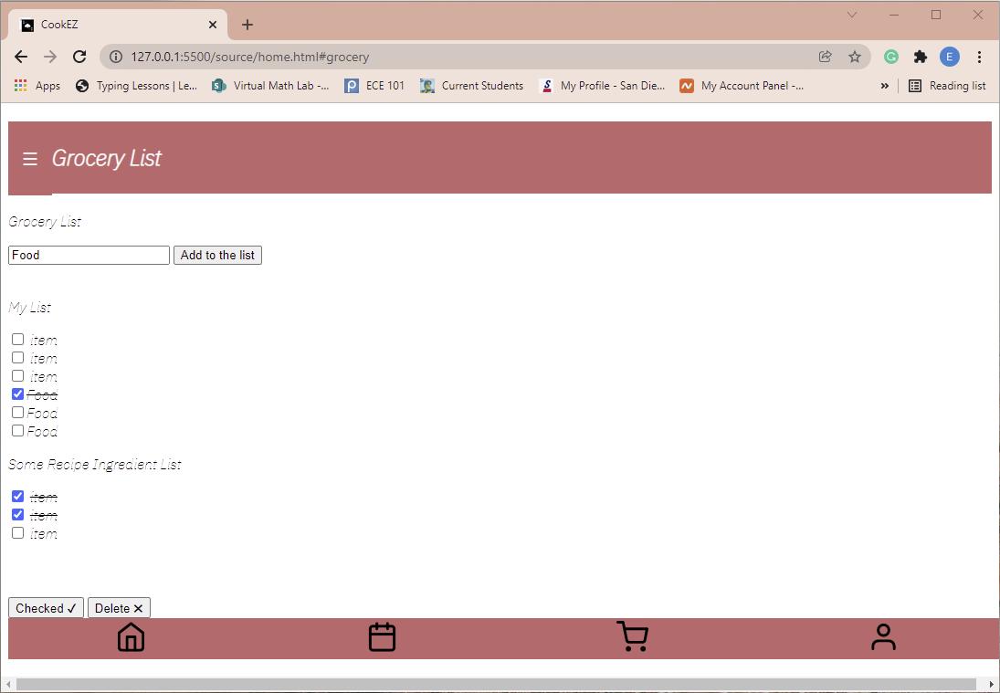
    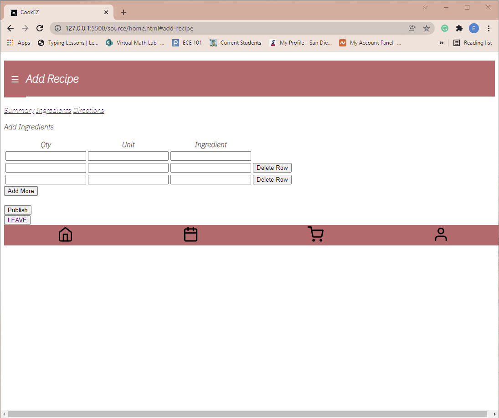
    
    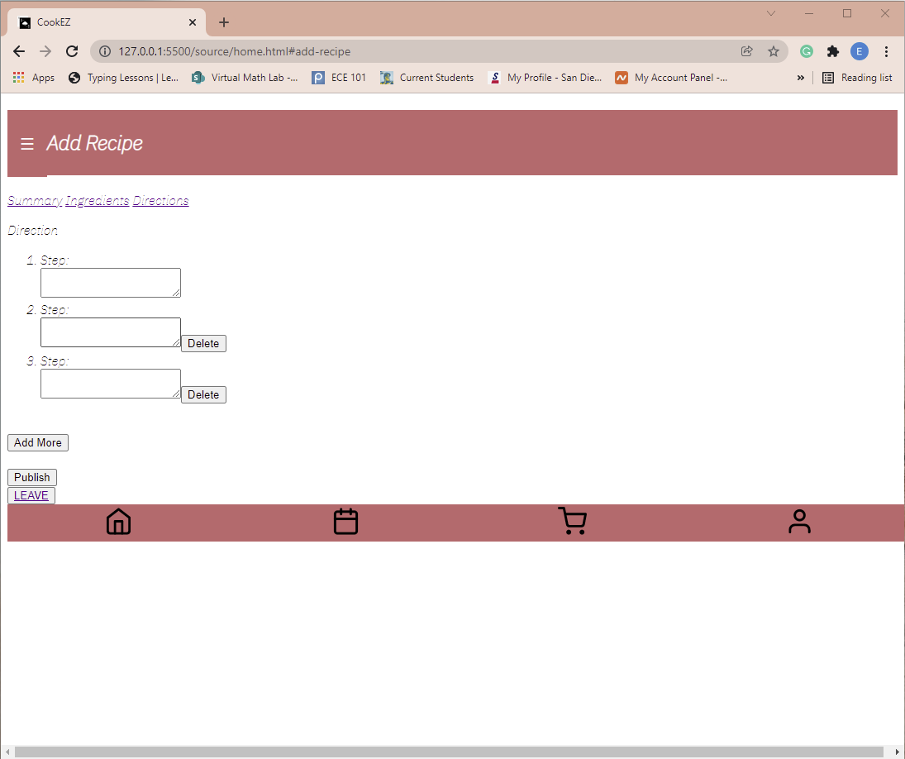
    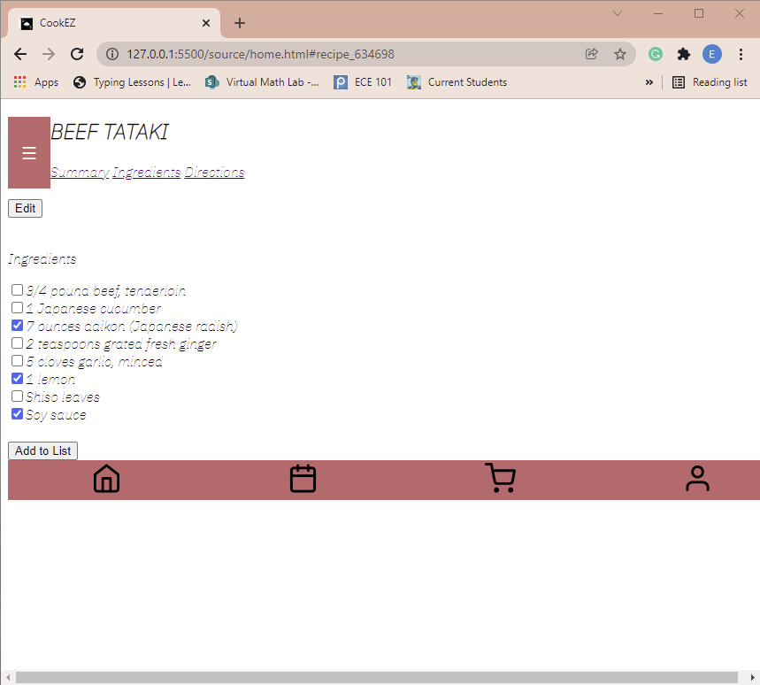
    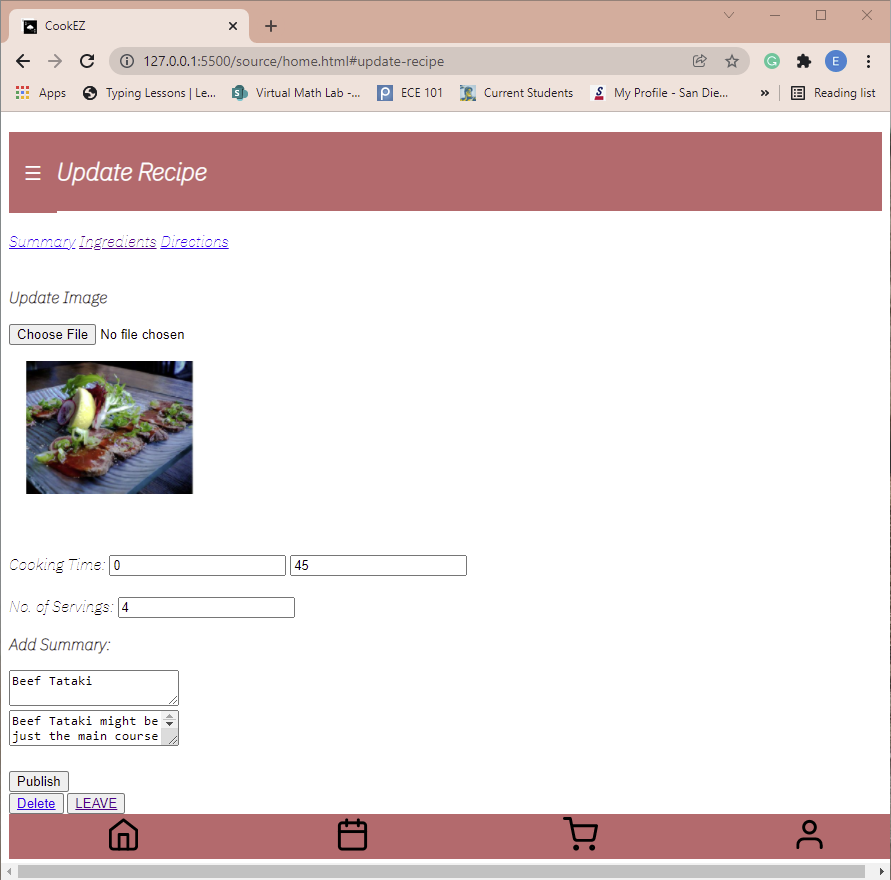
    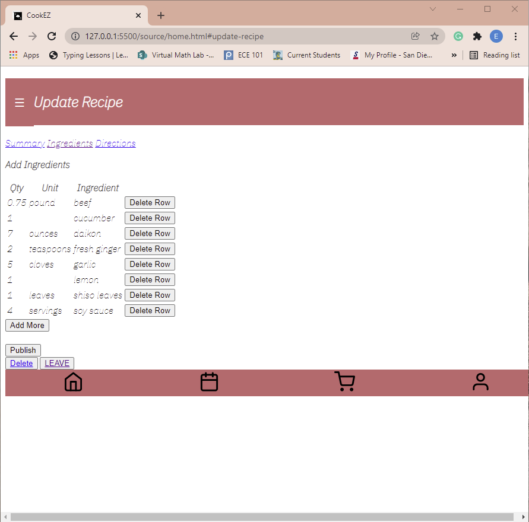
    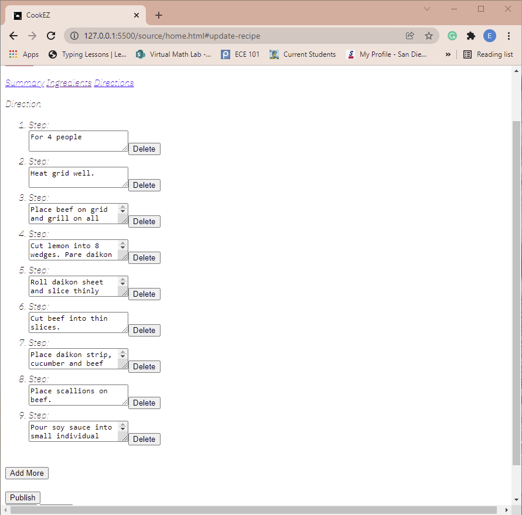

  

- **Martin Flores-leon**
  - worked with mostly the frontend team this time around getting the user created recipes to be displayed on the user profile, as well as working to get the format displayed correctly when we click on that user created recipe. Here are some images that depict the work!!

  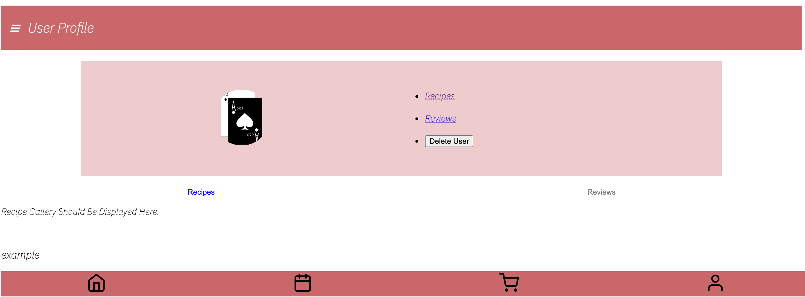
  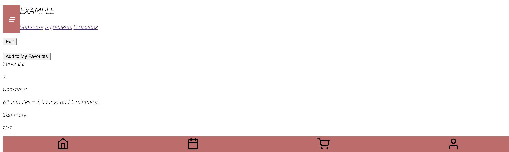

  

- **Stuart Boynton**
  - Worked on AddRecipe.js to allow us to create recipes and send to database.
  - Worked on UpdateRecipe.js to allow us to edit recipes that the user has previously created.
  - Helped other people in general for smaller things

  

- **Tiffany Zhong**
  - Throughout this past week I worked on implementing css through the main.css file, as well as through the js files. This involved debugging the side panel because it  was previously blocking components of the page. 
  - I also worked on creating a uniform footer and header throughout all the pages. 
  - After that I worked on the css for the recipe page and home page.

    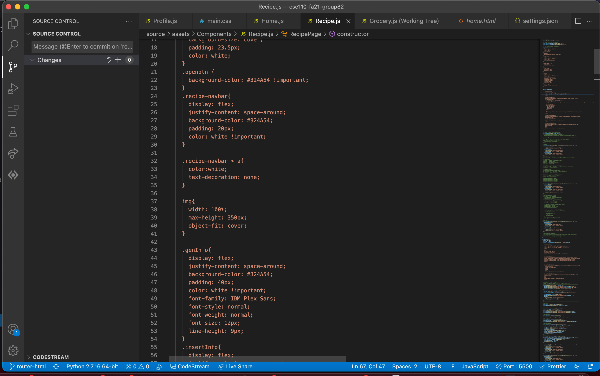
    
  
  

- **Eamon Aalipour**
  - In recent weeks, I have continued my work as a member of the backend team solidifying the login process. More specifically, a lot of my work has been based on refactoring the code to encompass a token system for authentication. This involved shaking up quite a bit of the code and I was able to get an even stronger understanding of how frontend communicates with backend. As always, I've also participated in code reviews and helping out different folks, especially now that we're moving to a token system.
  - Moving forward, my efforts have been spend researching Firebase to host our images as well as GCP to eventually host the site itself.

    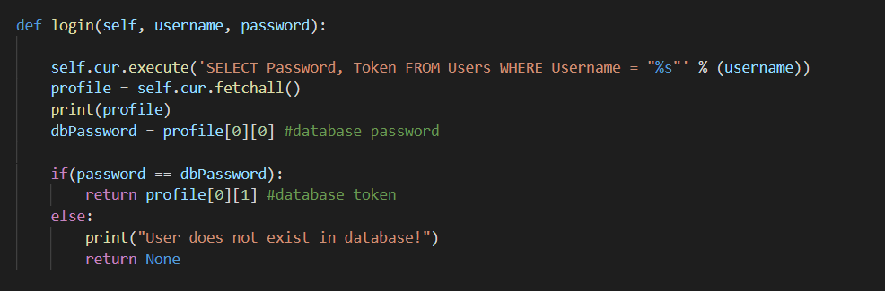
    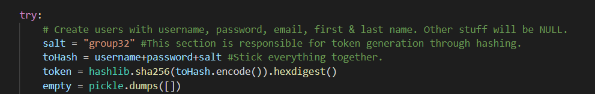

  

- **Ke Ou**
  - I worked on the recipe database with Eamon, Martin, Stuart, and Bagrat. 
  - I designed the main framework and working flow of the database class and implemented some member functions as well as integration with the frontend. I
  -  also helped Esther, Zijian, Hannah, Eamon, Martin, and Bagrat with debugging. Currently, I’m working on deploying the server on GCP.

  

- **Hannah Hui**
  - Worked a lot to help people with integrating CRUD features for recipe
  - Added CD frontend deployment and image compression to the pipeline
  - Assisted all around with questions and code reviews

  

## Duration
Time: 50min
